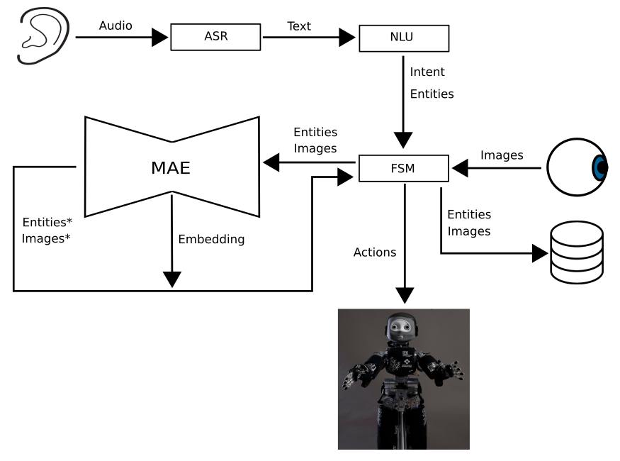

# CompleteRobot

This repository contains code for running a simple interaction with the iCub Robot. 
Using multimodal Representation Learning, the user is able to teach the iCub about different objects and their visual attributes.
For more details see Multimodal Representation Learning for Human Robot Interaction by Eli Sheppard and Katrin S. Lohan published at HRI 2020.

If you use this work please cite:
@inproceedings{Sheppard2020Multimodal,
  title={Multimodal Representation Learning for Human Robot Interaction},
  author={Eli Sheppard, Katrin S. Lohan},
  booktitle={2020 15th ACM/IEEE International Conference on Human-Robot Interaction (HRI)},
  year={2020},
  organization={IEEE}
}

# Dependencies

YARP
OpenCV
Tensorflow
Keras
Cuda
Rasa
Requests
Auditok
Sklearn
Wave
SpeechRecognition

# Running the interaction

After starting a yarpserver and the Yarp OpenCV Grabber Device and a RASA NLU server:

1) python yarp_utils/AudioGrabber.py
2) python NLU/NLUManager.py
3) python ImageProcessing/imageCropper.py
4) python MRL/MAE.py
5) python StateMachine/StateMachine.py

# Training the Rasa NLU
Data for training the RASA NLU can be found in NLU/data

#Pretraining the Multimodal Autoencoder
Data can be found [here](https://bit.ly/38lNh37)

# Notes
This is an incomplete version of this demo. Future work will replace the image cropper with an image segmentation system, currently objects are assumed to always be in the centre of the image.
The MAE currently uses a one-hot encoding of language, this will be replaced with a word2vec encoding to allow for an expanding vocabulary.

